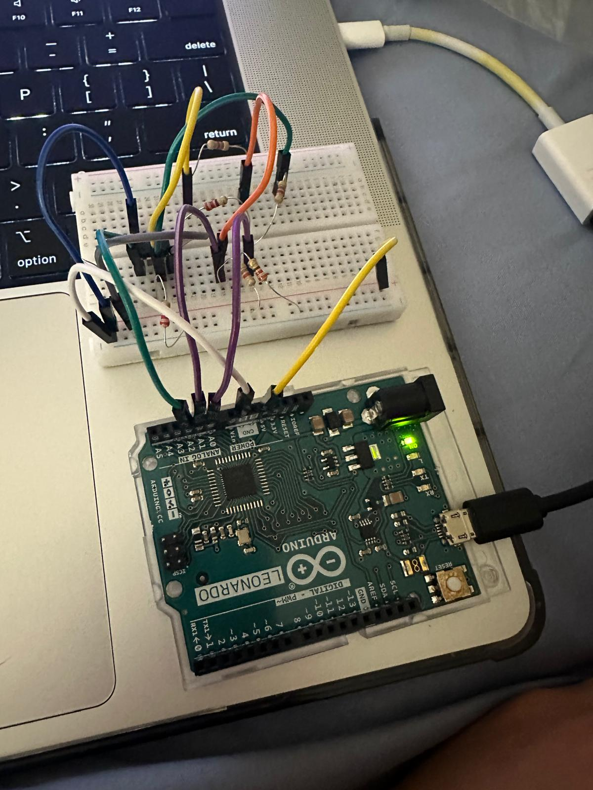
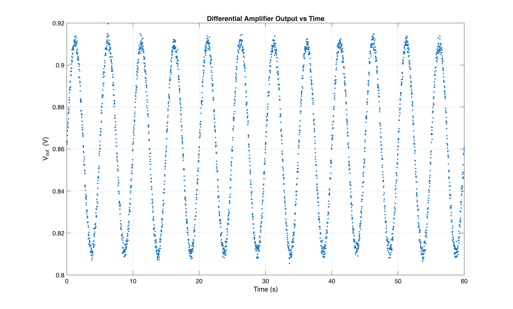
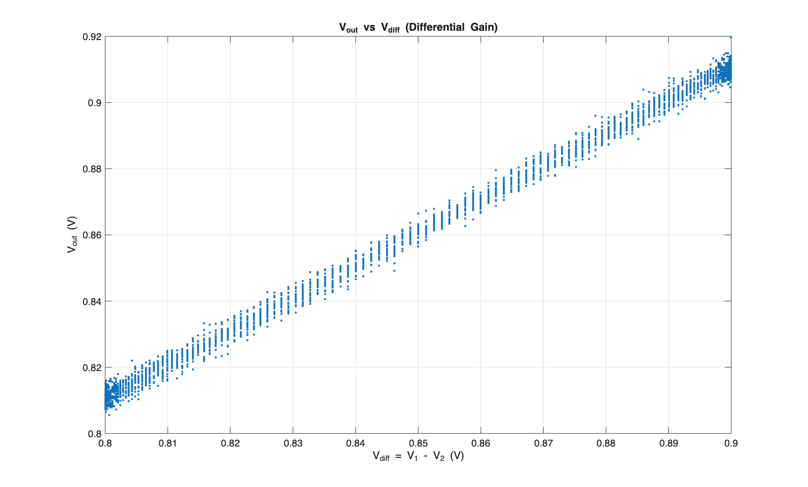
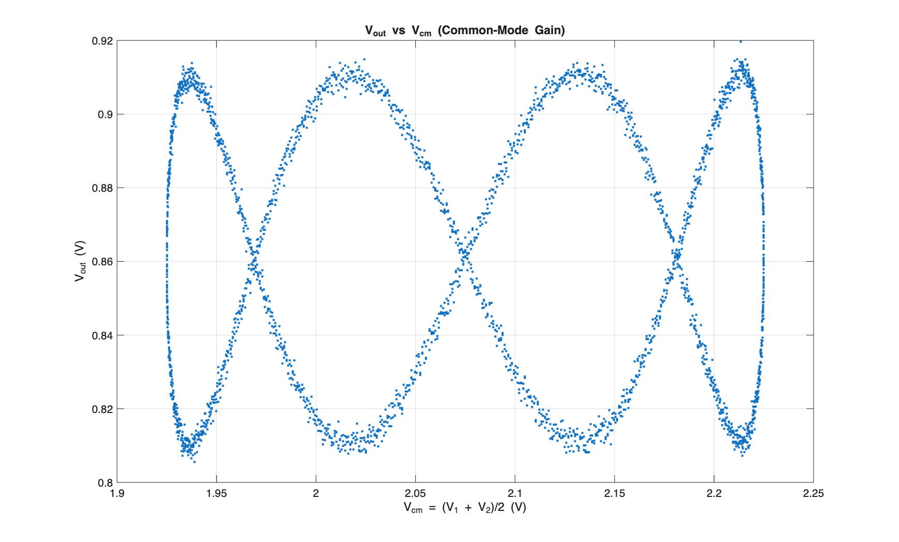

# Differential Amplifier CMRR Analysis (MATLAB)

## Overview
This project simulates a differential amplifier with realistic resistor ratio mismatch to evaluate key performance metrics, including differential gain (Ad), common-mode gain (Ac), offset voltage (Voff), and common-mode rejection ratio (CMRR). The analysis is implemented entirely in MATLAB and produces experimental-style data and plots.

## Tools
- MATLAB (simulation, regression analysis, data visualization)
- Arduino Uno (signal generation and data acquisition)
- Breadboard-based differential amplifier circuit
- Discrete resistors (intentional mismatch for CMRR evaluation)
- Jumper wires and USB interface

## Methods
The MATLAB script:
- Generates time-domain input signals with both differential and common-mode components  
- Models a differential amplifier with small resistor mismatches  
- Estimates Ad, Ac, Voff, and CMRR using linear regression  
- Exports simulated data and generates multiple diagnostic plots  

The simulation reflects non-ideal amplifier behavior commonly observed in real circuits.

## Circuit Reference
The following images show representative differential amplifier circuit configurations corresponding to the simulated model.

### Circuit Configuration 1

### Circuit Configuration 2

## Results

### Output Voltage vs Time

### Differential Gain (Vout vs Vdiff)

### Common-Mode Gain (Vout vs Vcm)

## Files
- `Assignment5Part2.m` — MATLAB simulation and analysis script  
- `diff_amp_capture.csv` — simulated data output  
- `diff_vout_time.png` — output voltage vs time  
- `diff_vout_vs_vdiff.png` — differential gain visualization  
- `diff_vout_vs_vcm.png` — common-mode gain visualization  
- `Circuit-1.jpg`, `Circuit-2.jpg` — reference circuit images  

